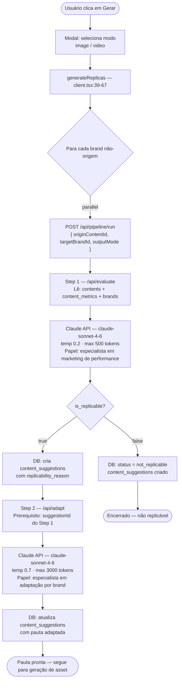
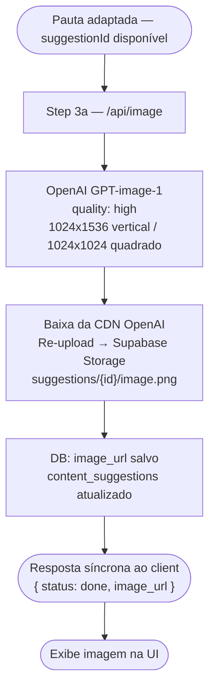

# Fluxo: Botão "Gerar" — Aba Análise de Hits

> Fluxo completo desde o clique em "Gerar" até a entrega do asset final.  
> Dividido em duas partes: **geração de pautas** (adaptação cross-brand via Claude) e **geração de imagens/vídeos** (assets via OpenAI e ElevenLabs).

---

---

# Parte 1 — Geração de Pautas para Outras Marcas

> O sistema avalia se um hit é replicável e, se sim, adapta o conteúdo (hook, briefing, roteiro) para cada brand destino.  
> Tecnologia: **Claude API** (`claude-sonnet-4-6`).



### O que o Claude produz no Step 1 (avaliação)

```
{ is_replicable: boolean, reason: string }
```

### O que o Claude produz no Step 2 (adaptação)

```typescript
{
  name: string              // título descritivo
  product: string           // produto da brand destino
  hook: string              // hook adaptado (estrutura preservada)
  scenery: string           // cenário adaptado
  description: string       // legenda pronta
  content_description: string // roteiro em passos
  briefing: string          // briefing criativo (400–600 palavras)
  estimated_ctr: number
  estimated_roas: number
  estimated_views: number
  estimated_impact_score: number  // 0–100
  justificativa_adaptacao: string
}
```

### Arquivos envolvidos

| Arquivo | Papel |
|---|---|
| `app/analise-hits/client.tsx` | Dispara chamadas paralelas por brand |
| `app/api/pipeline/run/route.ts` | Orquestrador — chama evaluate → adapt em sequência |
| `app/api/evaluate/route.ts` | Step 1: prompt + Claude + DB write |
| `app/api/adapt/route.ts` | Step 2: prompt + Claude + DB update |
| `lib/ai/claude.ts` | Wrapper Anthropic SDK com prompt caching |

---

---

# Parte 2 — Geração de Imagem

> Com a pauta adaptada, o sistema gera o asset visual via OpenAI.  
> Tecnologia: **OpenAI GPT-image-1**.



### Arquivos envolvidos

| Arquivo | Papel |
|---|---|
| `app/api/image/route.ts` | Geração de imagem via OpenAI |
| `lib/ai/openai.ts` | Wrapper OpenAI SDK |

---

---

## Banco de Dados — Tabela `content_suggestions`

Única tabela que acumula o estado das duas partes ao longo do fluxo.

```
-- Identidade
id, origin_content_id, origin_brand_id, target_brand_id, platform, output_mode

-- Parte 1: Pauta
is_replicable, replicability_reason
name, product, hook, scenery, description, content_description, briefing
estimated_ctr, estimated_roas, estimated_views, estimated_impact_score

-- Parte 2: Asset
image_url

-- Estado geral
status: not_replicable | draft | approved | rejected | in_play | published
ai_model_version, ai_generated_at, created_at
```
